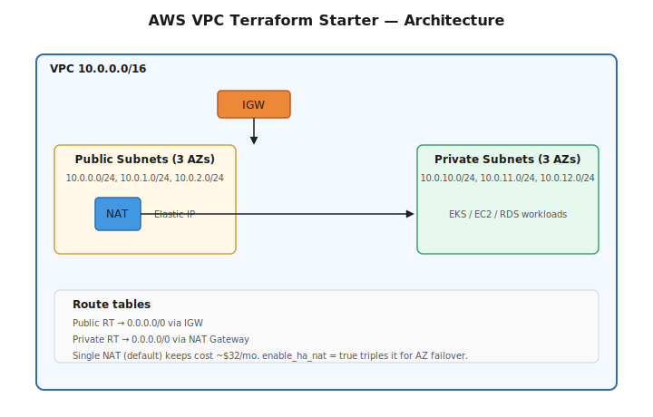

# AWS VPC Terraform Starter

A clean, production-ready AWS VPC built with Terraform. Multi-AZ public/private subnets, single-NAT cost optimization, IGW, route tables, and proper tags. The reference module I reach for when starting any new AWS workload.



## What it builds

- 1 VPC (configurable CIDR, default `10.0.0.0/16`)
- 3 public subnets across 3 AZs (with auto-assigned public IPs)
- 3 private subnets across 3 AZs (no public IPs)
- 1 Internet Gateway (for public subnet egress)
- 1 NAT Gateway in the first public subnet (single-NAT for cost; see notes)
- Public + private route tables, properly associated
- Sensible default tags for cost allocation and ownership

## Stack

- Terraform `>= 1.5`
- AWS Provider `~> 5.0`
- Region: any (default `us-east-1`)

## Quick start

```bash
git clone https://github.com/your-username/aws-vpc-terraform-starter.git
cd aws-vpc-terraform-starter

terraform init
terraform plan
terraform apply
```

Override defaults via `-var`:

```bash
terraform apply \
  -var='region=eu-west-1' \
  -var='vpc_cidr=10.20.0.0/16' \
  -var='project=my-app' \
  -var='environment=staging'
```

## Outputs

| Name | Description |
|---|---|
| `vpc_id` | The VPC ID |
| `public_subnet_ids` | List of public subnet IDs |
| `private_subnet_ids` | List of private subnet IDs |
| `nat_gateway_public_ip` | The NAT Gateway's Elastic IP (whitelist this for outbound services) |

## Cost

| Resource | Approx. monthly |
|---|---|
| NAT Gateway (1× single AZ) | ~$32 |
| Elastic IP (attached, free) | $0 |
| Data transfer | varies |
| **Subtotal** | **~$32 + data transfer** |

For HA, scale to 3 NAT Gateways (one per AZ) — see `examples/multi-az/`.

## Design choices

- **Single NAT Gateway** by default. HA NAT (one per AZ) costs 3× as much for marginal benefit at this size. Toggle via `enable_ha_nat = true` (see `variables.tf`).
- **No DB subnets**. This module is intentionally network-only. Add an RDS subnet group in a downstream module if needed.
- **No VPC endpoints**. Add S3 / SSM / ECR endpoints from the consuming module — different workloads need different sets.
- **No flow logs**. Add via a downstream module so log destination (S3 vs. CloudWatch) is the consumer's choice.

## Project structure

```
aws-vpc-terraform-starter/
├── README.md
├── main.tf            # Provider, locals, common tags
├── vpc.tf             # VPC, IGW, NAT, route tables, subnets
├── variables.tf
├── outputs.tf
├── docs/
│   └── architecture.svg
└── examples/
    └── multi-az/      # HA NAT (one per AZ) example
        └── main.tf
```

## Why this exists

Most teams write the same VPC code on every new project. This is the version I've battle-tested — clean, no dead code, no over-engineering, no Terraform module-of-modules indirection. Read the four `.tf` files top-to-bottom and you understand the whole network.

## License

MIT
